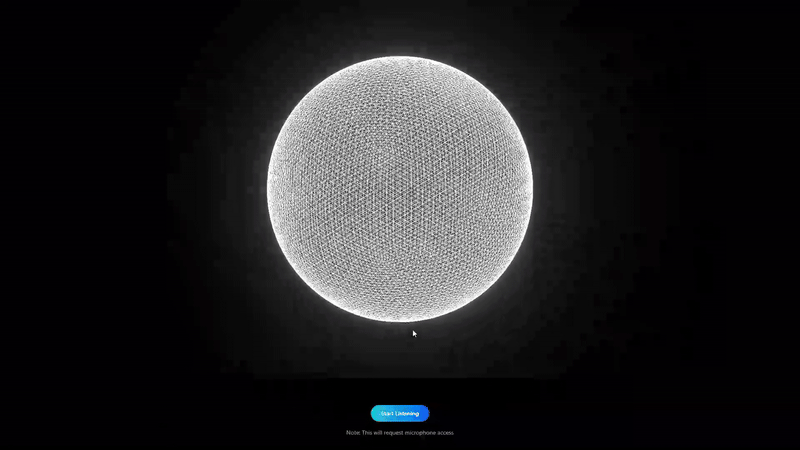

# Audio Visualizer

```
# Made with ♥ by Ampcome
$ echo "Crafted with precision and care"
$ open https://ampcome.com
```


[View Demo](https://ampcome.github.io/audio-visualizer/#/) | [Features](#features) | [Installation](#installation) | [Usage](#usage) | [API Reference](#api-reference)



## Features

- **Real-time Audio Visualization**: Transform microphone input into stunning 3D visuals
- **High Performance**: Optimized rendering with adaptive quality settings
- **Customizable Appearance**: Adjust colors, bloom effects, and visual parameters
- **Interactive Controls**: Optional GUI for real-time customization
- **Responsive Design**: Adapts to all screen sizes and device capabilities
- **Post-processing Effects**: Beautiful bloom effects for enhanced visuals
- **Easy Integration**: Simple React component with minimal configuration
- **TypeScript Support**: Full type definitions for enhanced developer experience

## Installation

```bash
npm install https://github.com/Ampcome/audio-visualizer.git#package
# or
yarn add https://github.com/Ampcome/audio-visualizer.git#package
```

## Usage

### Basic Example

```tsx
import React from 'react';
import { AudioVisualizer, useAudioListener } from 'audio-visualizer';

const App = () => {
  const { isListening, audioData, error, startListening, stopListening } = useAudioListener();

  return (
    <div style={{ width: '100%', height: '500px' }}>
      <AudioVisualizer 
        audioData={audioData} 
        isListening={isListening} 
      />
      <button onClick={isListening ? stopListening : startListening}>
        {isListening ? 'Stop' : 'Start'} Listening
      </button>
      {error && <div>Error: {error}</div>}
    </div>
  );
};

export default App;
```

### Advanced Example

```tsx
import React from 'react';
import { AudioVisualizer, useAudioListener } from 'audio-visualizer';

const App = () => {
  const { isListening, audioData, error, startListening, stopListening } = useAudioListener();
  
  return (
    <div style={{ width: '100%', height: '500px' }}>
      <AudioVisualizer 
        audioData={audioData} 
        isListening={isListening}
        initialQuality="high"
        orbColors={{ red: 0.8, green: 0.2, blue: 0.7 }}
        initialGlow={{ threshold: 0.4, strength: 0.7, radius: 0.5 }}
        enableOrbitControls={true}
        autoRotate={true}
        showGui={true}
        inertiaEnabled={true}
        inertiaLevel={0.05}
        zoomEnabled={false}
        spikeLevel={5.5}
        smoothnessLevel={0.7}
        className="my-visualizer"
      />
      <button onClick={isListening ? stopListening : startListening}>
        {isListening ? 'Stop' : 'Start'} Listening
      </button>
    </div>
  );
};

export default App;
```

## API Reference

### `AudioVisualizer` Component

| Prop | Type | Required | Description |
|------|------|----------|-------------|
| `audioData` | `Uint8Array \| null` | Yes | Audio frequency data array from useAudioListener |
| `isListening` | `boolean` | Yes | Whether the visualizer is actively listening to audio |
| `initialQuality` | `'low' \| 'medium' \| 'high'` | No | Initial quality setting for the visualizer (default: 'medium') |
| `orbColors` | `ColorParams` | No | Initial color settings for the visualizer |
| `canvasColor` | `number \| string \| { r: number; g: number; b: number }` | No | Initial background color (default: 0x000000) |
| `initialGlow` | `BloomParams` | No | Initial bloom effect settings |
| `enableOrbitControls` | `boolean` | No | Whether to enable orbit controls (default: true) |
| `autoRotate` | `boolean` | No | Whether to enable auto-rotation (default: false) |
| `showGui` | `boolean` | No | Whether to enable GUI controls (default: false) |
| `guiPositionTop` | `number` | No | GUI position top (default: 100) |
| `inertiaEnabled` | `boolean` | No | Whether to enable inertia (default: true) |
| `inertiaLevel` | `number` | No | Inertia level (default: 0.05) |
| `zoomEnabled` | `boolean` | No | Whether to enable zoom (default: false) |
| `spikeLevel` | `number` | No | Spike level for the visualizer (default: 5.5) |
| `smoothnessLevel` | `number` | No | Smoothness level for the visualizer (default: 0.7) |
| `className` | `string` | No | Custom class name for the container (default: '') |
| `containerStyle` | `React.CSSProperties` | No | Custom inline styles for the container |

### `ColorParams` Interface

| Property | Type | Default | Description |
|----------|------|---------|-------------|
| `red` | `number` | `1.0` | Red color component (0-1) |
| `green` | `number` | `1.0` | Green color component (0-1) |
| `blue` | `number` | `1.0` | Blue color component (0-1) |

### `BloomParams` Interface

| Property | Type | Default | Description |
|----------|------|---------|-------------|
| `threshold` | `number` | `0.5` | Bloom threshold (0-1) |
| `strength` | `number` | `0.3` | Bloom strength (0-3) |
| `radius` | `number` | `0.8` | Bloom radius (0-1) |

### `useAudioListener` Hook

| Return Value | Type | Description |
|--------------|------|-------------|
| `isListening` | `boolean` | Whether the visualizer is actively listening |
| `audioData` | `Uint8Array \| null` | Audio frequency data array |
| `error` | `string \| null` | Error message if microphone access fails |
| `startListening` | `() => void` | Function to start listening |
| `stopListening` | `() => void` | Function to stop listening |

## Browser Support

The Audio Visualizer is compatible with all modern browsers that support WebGL and the Web Audio API:

| Browser | Support |
|---------|----------|
| Chrome | ✅ (v49+) |
| Firefox | ✅ (v51+) |
| Safari | ✅ (v11+) |
| Edge | ✅ (v79+) |
| Opera | ✅ (v36+) |

Mobile browsers are also supported, though performance may vary depending on the device capabilities.

## Performance Considerations

The 3D audio visualization can be resource-intensive, especially on lower-end devices. Consider the following tips for optimal performance:

- Use the `initialQuality` option to adjust rendering quality based on target devices
- For mobile devices, consider using the 'low' quality setting
- Disable `autoRotate` and `showGui` on lower-end devices to improve performance
- The visualizer automatically detects device capabilities and adjusts settings accordingly
- Consider implementing a quality toggle for end-users to choose based on their device performance

For low-end devices, the visualizer will automatically:
- Reduce geometry complexity
- Lower the rendering resolution
- Limit the frame rate
- Use simpler shaders

## License

MIT © [Ampcome](https://ampcome.com)
